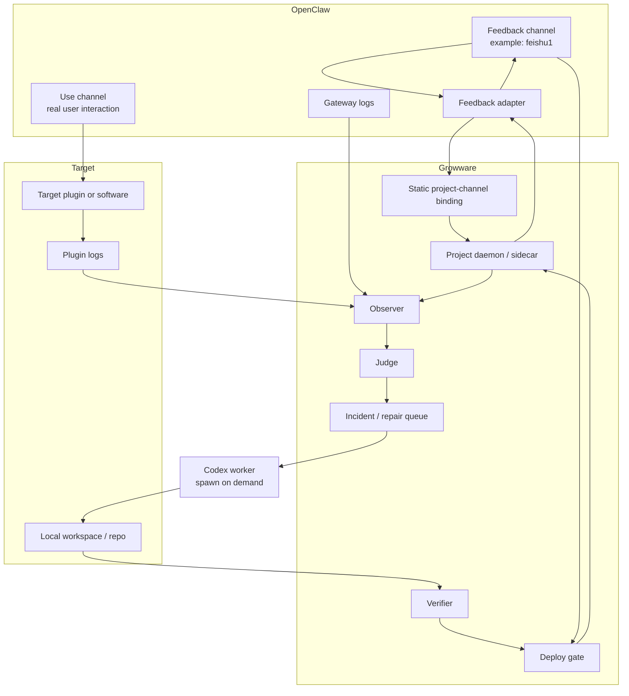
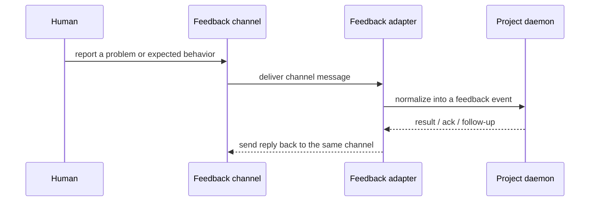

# Architecture

[English](architecture.md) | [中文](architecture.zh-CN.md)

## Purpose

This document explains the current recommended architecture for Growware based on the ongoing discussion.

It is intentionally opinionated about the first pilot:

- one real OpenClaw-connected project first
- static channel binding instead of a dynamic routing engine
- a lightweight project daemon or sidecar
- Codex invoked on demand, not kept resident per project

For milestone order and readiness gates, see [roadmap.md](roadmap.md) and [reference/growware/development-plan.md](reference/growware/development-plan.md).

## Current Design Conclusion

The current recommended pilot shape is:

- `A` is narrowed to a human feedback ingress first
- `B` is the real use channel plus runtime evidence
- `A/B routing` is replaced by explicit per-project channel binding
- OpenClaw remains the host gateway and ecosystem surface
- Growware adds the project-level control layer
- Codex acts as an on-demand repair worker behind the control layer

## Responsibility Boundary

| Layer | Owns | Does not own |
| --- | --- | --- |
| OpenClaw | channels, sessions, plugins, hooks, services, task/taskflow infrastructure, ecosystem integration | incident judgment policy, project-specific verification rules, repair memory |
| Growware | project binding, feedback intake, observer, judge, incident queue, verifier, deploy gate, project state | replacing OpenClaw as the gateway, replacing Codex as the coding agent |
| Codex | incident analysis, code edits, validation runs, repair output | long-lived channel hosting, durable project state, final product policy |
| Target project or plugin | actual runtime behavior, project logs, run/test/deploy hooks | cross-project control policy |

## First-Pilot Assumptions

The current architecture assumes:

- one OpenClaw-connected target project first, such as `openclaw task system`
- one explicit human feedback channel for that project, such as `feishu1`
- one or more runtime or use channels for real usage
- local-first execution and deployment
- human approval retained at deployment boundaries

## Current Recommended Topology



## Main Data Flows

### 1. Human Feedback Flow

This is the part you already described clearly:

`feishu1 -> OpenClaw adapter -> project daemon`

That establishes the bidirectional feedback channel.



### 2. Runtime Evidence Flow

The first pilot does not need a smart `B` router.

It needs configured evidence sources:

- OpenClaw gateway logs
- target plugin logs
- daemon logs
- optional structured events from the target project

The observer collects those sources, but collection is not judgment.

### 3. Repair Flow

When the judge decides that evidence is a real incident:

1. Growware creates or updates an incident record.
2. Codex is invoked with the incident, repo context, and verification commands.
3. Codex proposes or applies a patch in the local workspace.
4. Verifier runs the required checks.
5. Deploy gate decides whether to reject, queue for approval, or deploy locally.
6. Result is sent back through the feedback channel when needed.

## Why Static Binding Replaces Routing First

The current pilot does not need an intelligent `A/B routing engine`.

It only needs an explicit binding like:

```yaml
project_id: project-1
feedback_channels:
  - feishu1
runtime_channels:
  - user-channel-1
watched_plugins:
  - openclaw-task-system
log_sources:
  - openclaw-gateway
  - project-daemon
approval_channels:
  - feishu1
```

This is enough while:

- project count is small
- channel ownership is explicit
- one human can clearly tell which project a channel belongs to

If many projects later share channels, logs, or deployment paths, then a stronger routing layer becomes justified.

## Why Judge Still Exists

Removing dynamic routing does not remove the need for a judge.

The observer answers:

- where did the signal come from
- what evidence was captured

The judge answers:

- is this normal noise or a real incident
- how severe is it
- can it be auto-repaired
- does it require human approval

Without this layer, the system falls back to "read logs and guess."

## Project Daemon Role

The recommended first-pilot daemon is intentionally thin.

It should own:

- project binding and local state
- watched log and event sources
- incident intake
- repair queue handoff
- local run/test/deploy/rollback hooks
- result replies back into the feedback channel

It should not try to become:

- a permanent resident Codex session
- a replacement for OpenClaw gateway features
- a generalized multi-project orchestrator on day one

## Minimal Event Contracts

### Feedback Event

```json
{
  "project_id": "project-1",
  "channel_id": "feishu1",
  "message_id": "msg-123",
  "event_type": "human_feedback",
  "text": "the plugin output is wrong for task creation",
  "related_session_id": "sess-456",
  "related_plugin": "openclaw-task-system",
  "timestamp": "2026-04-13T18:00:00+08:00",
  "requires_reply": true
}
```

### Incident Record

```json
{
  "project_id": "project-1",
  "incident_id": "inc-001",
  "source": "gateway-log",
  "summary": "task creation fails after confirmation",
  "severity": "medium",
  "evidence": ["log excerpt", "session id", "feedback event"],
  "reproducible": false,
  "approval_required": true
}
```

## Deployment Shape Options

### Option 1. Embedded inside OpenClaw plugin or service

Shape:

- Growware daemon lives as an OpenClaw plugin or service
- it reuses OpenClaw hooks, tasks, taskflow, and ecosystem wiring directly

Best when:

- the pilot only targets OpenClaw-connected projects
- you want the smallest operational surface first

### Option 2. External sidecar attached to OpenClaw

Shape:

- Growware daemon runs outside OpenClaw
- OpenClaw forwards events through MCP, hooks, or another bridge

Best when:

- you expect Growware to outgrow OpenClaw later
- you want stronger process isolation

### Current Recommendation

For the first pilot, either option is valid.

The more important choice is not embedding versus sidecar. The important choice is keeping the responsibilities clean:

- OpenClaw hosts channels and ecosystem integration
- Growware owns project control logic
- Codex runs on demand as a worker

## What This Architecture Is Not

- not a new chat shell around Codex
- not a replacement for OpenClaw gateway, plugins, tasks, or MCP
- not a full autonomous platform already
- not a dynamic multi-project scheduler yet

## Future Expansion Points

Add stronger project-level routing only when needed for:

- multiple projects sharing channels
- multiple projects sharing the same log sources
- parallel repair workers
- isolated deployment gates per project
- reusable regression memory across projects
