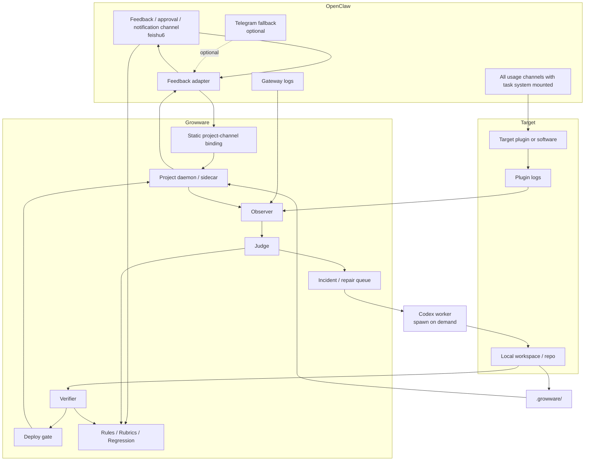
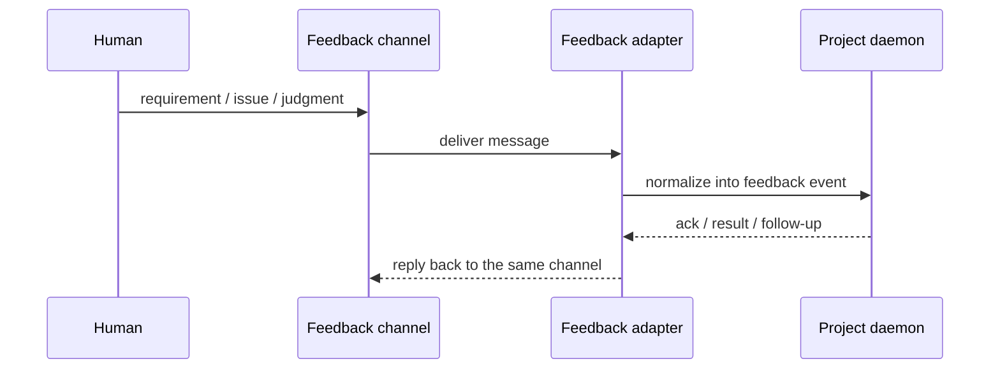

# Architecture

[English](architecture.md) | [中文](architecture.zh-CN.md)

## Purpose

This document answers a more basic question before "how do we wire OpenClaw": what kind of system Growware actually is.

It is based on the full origin conversation, not only the incomplete share transcript. From that baseline, it then explains the currently recommended pilot architecture.

## What The Project Is

Growware is not a chat tool for asking AI to write code, and it is not only an automatic repair daemon that watches logs and patches bugs.

A more accurate system definition is:

- the `A window` is the product control plane
- the `B window` is the runtime surface and evidence source
- the hidden control plane is the evolution engine

That evolution engine keeps three co-evolving artifacts aligned:

1. `spec`: what the software should do
2. `judge`: what counts as correct or wrong
3. `code`: the current implementation

So Growware is trying to automate more than "write code." It is trying to automate three loops:

1. build software: intent to spec, implementation, verification, deployment
2. repair software: runtime evidence to incident, repair, verification, reply
3. learn software: turn one piece of feedback into rules, rubrics, regression tests, and constraints

## What It Is Not

- not a replacement for OpenClaw
- not a replacement for Codex
- not the short path of `A window sentence -> LLM edits code -> deploy`
- not a bug-fix-only watchdog

Growware should fill the missing project-level control plane between OpenClaw and Codex.

## Current Recommended Layering

| Layer | Owns | Does not own |
| --- | --- | --- |
| OpenClaw | channels, gateway behavior, plugins, hooks, services, task infrastructure, ecosystem integration | project-level `judge`, repair memory, software evolution rules |
| Growware | project binding, feedback intake, observer, judge, incident queue, verifier, deploy gate, state machine | rewriting OpenClaw's host layer, rewriting Codex itself |
| Codex | incident analysis, code edits, validation runs, repair output | long-lived channel hosting, durable project state, final product policy |
| Target project or plugin | actual runtime behavior, real logs, run/test/deploy/rollback hooks | cross-project orchestration and control policy |

## Current Recommended Pilot Shape

For the first pilot, keep the design narrow and realistic:

- lock `Project 1` to `openclaw-task-system`
- `A` is narrowed to `human feedback ingress`
- `B` is the real use path and runtime evidence surface
- use `feishu6` as the single default human feedback, approval, and notification entry
- keep `Telegram` only as a fallback or later secondary notification channel, not the primary pilot surface
- treat all usage channels with `task system` mounted by default as `B` surfaces
- do not build a dynamic `A/B routing engine` first
- use explicit `project-channel binding`
- give each project a lightweight `project daemon / sidecar`
- keep project-level rules, contracts, and memory in `.growware/` under the target project root
- keep the human-readable policy source in `docs/policy/` and compile it into `.policy/` through `scripts/growware_policy_sync.py`
- keep the Stage 2 and Stage 3 paper baseline in `docs/reference/growware/stage-2-3-baseline*` and compile it into `.growware/stage-2-3/`
- keep one isolated experimental runtime in `experiments/mock_runtime/` that consumes `.policy/`, `.growware/daemon-foundation/`, and `.growware/stage-2-3/` without mutating the real target project
- keep `Codex` as an on-demand worker, not a resident session per project

## Current Experimental Runtime

The current approved runtime step is intentionally narrow:

- use `experiments/mock_runtime/runtime.py` as a local-only harness
- load the compiled machine layers instead of re-parsing prose at runtime
- bridge into the real `openclaw-task-system` workspace only through readonly executor commands
- keep `deploy` and `rollback` approval-gated
- keep the target-project workspace unmodified
- model the control loop as state transitions and structured payloads first

That means the experimental runtime proves daemon-side control flow only. It does not yet prove:

- `feishu6 -> Growware -> openclaw-task-system` end-to-end wiring
- target-project code mutation
- project-bound write actions
- deploy or rollback execution
- production-ready automation

## Pilot Topology



## Current Recommended Pilot Binding

After this round of discussion, the first business-validation loop should be narrowed to these defaults:

- `Project 1 = openclaw-task-system`
- `A channel = feishu6`
- the `A channel` carries:
  - human feedback
  - approvals
  - decisions and status notifications
- `B surfaces = all usage channels where task system is mounted by default`
- keep `Telegram` as a backup channel only for now

This default set keeps the shape simple:

- one human judgment surface
- no mixing between feedback and real use
- all real use of `task system` falls into one runtime evidence boundary
- project-level control stays aligned with the project repository itself

## The Three Main Flows

### 1. Feedback flow

This is the shape you already defined clearly:

`feishu6 -> OpenClaw adapter -> project daemon`

If the daemon can also reply back through the same channel, the bidirectional feedback channel exists.



### 2. Runtime evidence flow

The first stage does not need a dynamic `B` router, but it does need explicit evidence sources:

- OpenClaw gateway logs
- target plugin logs
- daemon logs
- optional structured events from the target project

The `Observer` collects.  
The `Judge` decides whether this is a problem, what kind of problem it is, and whether it can be auto-repaired.  
Collection does not replace judgment.

### 3. Evolution flow

The most important part of the full origin conversation is not "repair once," but "learn once":

`A window feedback -> update spec / rubric / detector / eval -> edit code -> verify -> deploy`

That flow is what makes Growware a software factory or growth engine instead of repeated chat-based bug fixing.

## Why `Judge` Cannot Be Removed

Without a `judge layer`, the system collapses into:

`read logs -> guess whether it is a problem -> ask Codex to try`

That is not a closed loop and not evolution.

At minimum, the judge must answer:

- is this noise or an incident
- is it a specification-gap problem or a runtime-observable problem
- how severe is it
- can it be auto-repaired
- is human approval required

## Why Static Binding Comes First

The current pilot can avoid dynamic `A/B routing` and use explicit binding instead:

```yaml
project_id: project-1
project_name: openclaw-task-system
feedback_channels:
  - feishu6
runtime_channels:
  - "*"
watched_plugins:
  - openclaw-task-system
log_sources:
  - openclaw-gateway
  - project-daemon
approval_channels:
  - feishu6
notification_channels:
  - feishu6
fallback_channels:
  - telegram
```

That is enough to define:

- the human feedback entry
- the runtime and evidence surfaces
- which plugins and logs belong to the project
- that all decision notifications return to `feishu6`

Only when many projects share channels, logs, or deployment boundaries does a stronger routing layer become necessary.

## `.growware/` Directory Boundary

For the first stage, I agree with storing the project-level Growware control surface inside the target project rather than only in the Growware meta-repo.

For `Project 1`, the current proposed shape is:

```text
openclaw-task-system/
  .growware/
    project.json
    channels.json
    contracts/
    policies/
    ops/
    runtime/
    logs/
```

Two categories should stay separate:

Should be tracked in Git:

- `project.json`
- channel-binding config
- `contracts/`
- `policies/`
- `docs/policy/`
- contract definitions
- deploy / approval policy
- durable rules learned from human feedback

Should not be tracked directly in Git:

- temporary runtime state
- local queues
- raw log cache
- one-off debug artifacts

This directory boundary is the Stage 1 recommendation for the target project once runtime implementation is explicitly approved.

## Minimal Event Contracts

These are v0 contract drafts for the Stage 1 paper gate. The consolidated implementation gate lives in [reference/growware/pilot-loop-v1.md](reference/growware/pilot-loop-v1.md).

### Feedback Event

```json
{
  "project_id": "project-1",
  "channel_id": "feishu1",
  "message_id": "msg-123",
  "event_type": "human_feedback",
  "text": "the plugin output is wrong for task creation",
  "related_session_id": "sess-456",
  "related_plugin": "openclaw-task-system",
  "timestamp": "2026-04-13T18:00:00+08:00",
  "requires_reply": true
}
```

### Incident Record

```json
{
  "project_id": "project-1",
  "incident_id": "inc-001",
  "source": "gateway-log",
  "summary": "task creation fails after confirmation",
  "severity": "medium",
  "evidence": ["log excerpt", "session id", "feedback event"],
  "problem_type": "runtime-observable",
  "reproducible": false,
  "approval_required": true
}
```

## Deployment Shape Options

### Option 1. Embedded inside OpenClaw plugin or service

Best when:

- the pilot is explicitly OpenClaw-only
- you want to reuse OpenClaw hooks, tasks, taskflow, and runtime containers directly

### Option 2. External sidecar

Best when:

- Growware may later attach to systems beyond OpenClaw
- you want to preserve Growware as an independent project-level control layer

In both cases the boundary should stay the same:

- OpenClaw owns hosting and integration
- Growware owns project control
- Codex owns controlled execution

For `Project 1`, the more specific recommendation is:

- runtime can still be either a sidecar or an OpenClaw service
- the runtime choice stays open until Stage 2 starts
- the durable project-level configuration should live in `openclaw-task-system/.growware/` once the pilot is authorized

## Current Documentation Constraint

Until the pilot begins, the implementation posture can stay conservative: semi-automatic, local-first, human-gated.  
But the project definition itself should no longer be narrowed to a closed-loop repair script or a document-first AI coding experiment.
