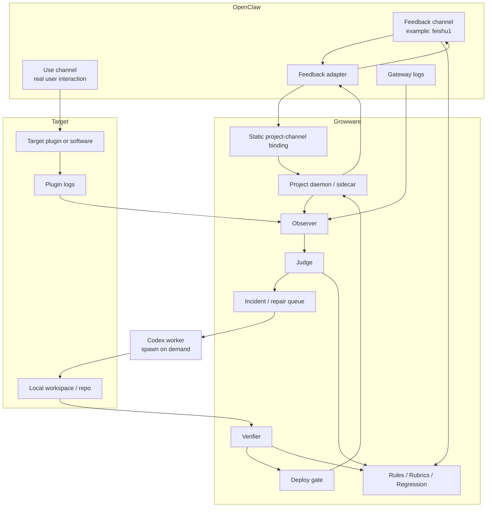
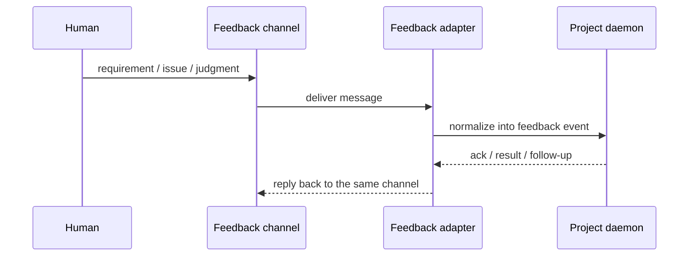

# Architecture

[English](architecture.md) | [中文](architecture.zh-CN.md)

## Purpose

This document answers a more basic question before "how do we wire OpenClaw": what kind of system Growware actually is.

It is based on the full origin conversation, not only the incomplete share transcript. From that baseline, it then explains the currently recommended pilot architecture.

## What The Project Is

Growware is not a chat tool for asking AI to write code, and it is not only an automatic repair daemon that watches logs and patches bugs.

A more accurate system definition is:

- the `A window` is the product control plane
- the `B window` is the runtime surface and evidence source
- the hidden control plane is the evolution engine

That evolution engine keeps three co-evolving artifacts aligned:

1. `spec`: what the software should do
2. `judge`: what counts as correct or wrong
3. `code`: the current implementation

So Growware is trying to automate more than "write code." It is trying to automate three loops:

1. build software: intent to spec, implementation, verification, deployment
2. repair software: runtime evidence to incident, repair, verification, reply
3. learn software: turn one piece of feedback into rules, rubrics, regression tests, and constraints

## What It Is Not

- not a replacement for OpenClaw
- not a replacement for Codex
- not the short path of `A window sentence -> LLM edits code -> deploy`
- not a bug-fix-only watchdog

Growware should fill the missing project-level control plane between OpenClaw and Codex.

## Current Recommended Layering

| Layer | Owns | Does not own |
| --- | --- | --- |
| OpenClaw | channels, gateway behavior, plugins, hooks, services, task infrastructure, ecosystem integration | project-level `judge`, repair memory, software evolution rules |
| Growware | project binding, feedback intake, observer, judge, incident queue, verifier, deploy gate, state machine | rewriting OpenClaw's host layer, rewriting Codex itself |
| Codex | incident analysis, code edits, validation runs, repair output | long-lived channel hosting, durable project state, final product policy |
| Target project or plugin | actual runtime behavior, real logs, run/test/deploy/rollback hooks | cross-project orchestration and control policy |

## Current Recommended Pilot Shape

For the first pilot, keep the design narrow and realistic:

- `A` is narrowed to `human feedback ingress`
- `B` is the real use path and runtime evidence surface
- do not build a dynamic `A/B routing engine` first
- use explicit `project-channel binding`
- give each project a lightweight `project daemon / sidecar`
- keep `Codex` as an on-demand worker, not a resident session per project

## Pilot Topology



## The Three Main Flows

### 1. Feedback flow

This is the shape you already defined clearly:

`feishu1 -> OpenClaw adapter -> project daemon`

If the daemon can also reply back through the same channel, the bidirectional feedback channel exists.



### 2. Runtime evidence flow

The first stage does not need a dynamic `B` router, but it does need explicit evidence sources:

- OpenClaw gateway logs
- target plugin logs
- daemon logs
- optional structured events from the target project

The `Observer` collects.  
The `Judge` decides whether this is a problem, what kind of problem it is, and whether it can be auto-repaired.  
Collection does not replace judgment.

### 3. Evolution flow

The most important part of the full origin conversation is not "repair once," but "learn once":

`A window feedback -> update spec / rubric / detector / eval -> edit code -> verify -> deploy`

That flow is what makes Growware a software factory or growth engine instead of repeated chat-based bug fixing.

## Why `Judge` Cannot Be Removed

Without a `judge layer`, the system collapses into:

`read logs -> guess whether it is a problem -> ask Codex to try`

That is not a closed loop and not evolution.

At minimum, the judge must answer:

- is this noise or an incident
- is it a specification-gap problem or a runtime-observable problem
- how severe is it
- can it be auto-repaired
- is human approval required

## Why Static Binding Comes First

The current pilot can avoid dynamic `A/B routing` and use explicit binding instead:

```yaml
project_id: project-1
feedback_channels:
  - feishu1
runtime_channels:
  - user-channel-1
watched_plugins:
  - openclaw-task-system
log_sources:
  - openclaw-gateway
  - project-daemon
approval_channels:
  - feishu1
```

That is enough to define:

- the human feedback entry
- the runtime and evidence surfaces
- which plugins and logs belong to the project

Only when many projects share channels, logs, or deployment boundaries does a stronger routing layer become necessary.

## Minimal Event Contracts

### Feedback Event

```json
{
  "project_id": "project-1",
  "channel_id": "feishu1",
  "message_id": "msg-123",
  "event_type": "human_feedback",
  "text": "the plugin output is wrong for task creation",
  "related_session_id": "sess-456",
  "related_plugin": "openclaw-task-system",
  "timestamp": "2026-04-13T18:00:00+08:00",
  "requires_reply": true
}
```

### Incident Record

```json
{
  "project_id": "project-1",
  "incident_id": "inc-001",
  "source": "gateway-log",
  "summary": "task creation fails after confirmation",
  "severity": "medium",
  "evidence": ["log excerpt", "session id", "feedback event"],
  "problem_type": "runtime-observable",
  "reproducible": false,
  "approval_required": true
}
```

## Deployment Shape Options

### Option 1. Embedded inside OpenClaw plugin or service

Best when:

- the pilot is explicitly OpenClaw-only
- you want to reuse OpenClaw hooks, tasks, taskflow, and runtime containers directly

### Option 2. External sidecar

Best when:

- Growware may later attach to systems beyond OpenClaw
- you want to preserve Growware as an independent project-level control layer

In both cases the boundary should stay the same:

- OpenClaw owns hosting and integration
- Growware owns project control
- Codex owns controlled execution

## Current Documentation Constraint

Until the pilot begins, the implementation posture can stay conservative: semi-automatic, local-first, human-gated.  
But the project definition itself should no longer be narrowed to a closed-loop repair script or a document-first AI coding experiment.
