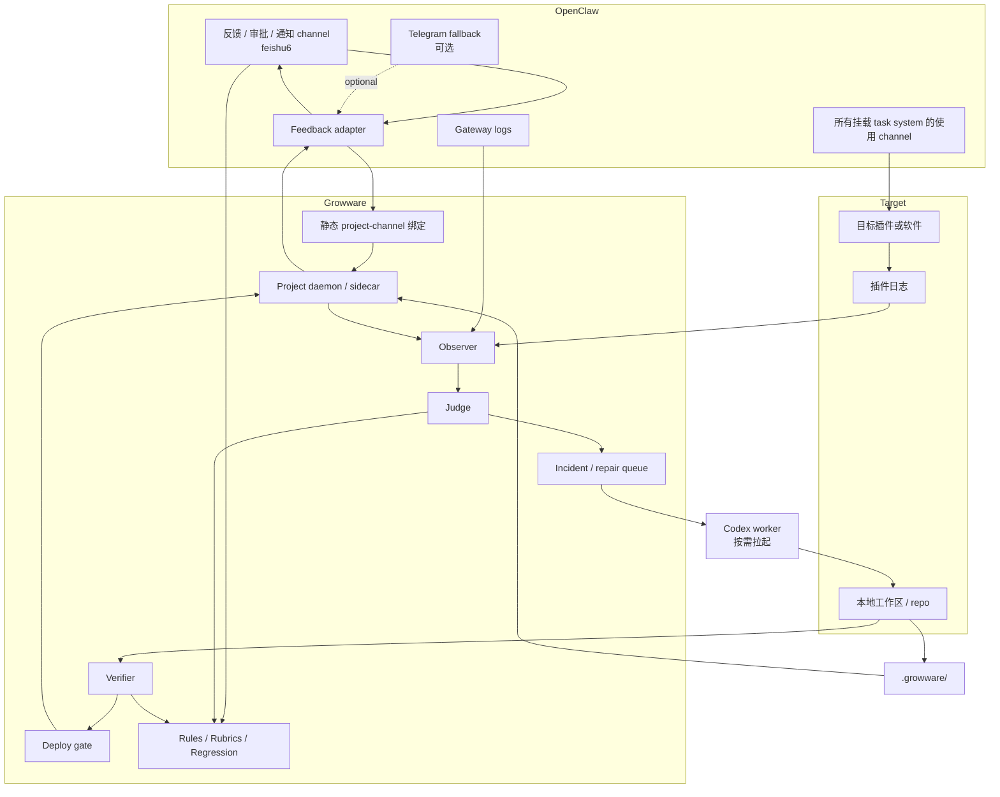
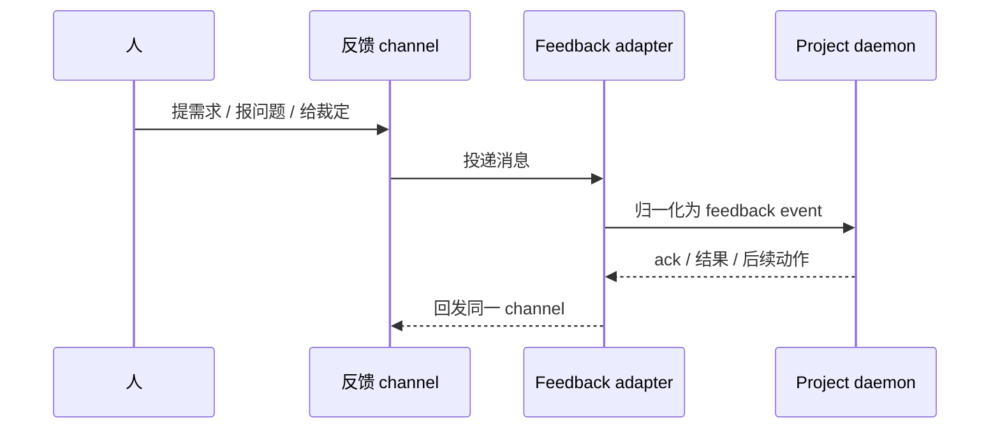

# 架构

[English](architecture.md) | [中文](architecture.zh-CN.md)

## 目的

这份文档先回答一个比“怎么接 OpenClaw”更根的问题：Growware 到底是什么系统。

它基于完整起源对话，而不是只基于不完整的分享页转录。  
在这个前提下，再说明当前最推荐的 pilot 架构。

## 项目是什么

Growware 不是“让 AI 写代码”的聊天工具，也不是只会看日志和打补丁的自动修复脚本。

它更准确的系统定义是：

- `A 窗口` 是产品控制面
- `B 窗口` 是运行面和证据源
- 隐藏控制面是演化引擎

这个演化引擎持续维护三类共同演化的资产：

1. `spec`：软件应该做什么
2. `judge`：什么叫对，什么叫错
3. `code`：当前实现

所以 Growware 真正要自动化的，不只是“写代码”，而是这三条回路：

1. 造软件：从意图到规格、实现、验证、部署
2. 修软件：从运行证据到 incident、修复、验证、回发
3. 学软件：把一次反馈沉淀成规则、rubric、回归测试和约束

## 它不是什么

- 不是 OpenClaw 的替代品
- 不是 Codex 的替代品
- 不是 “A 说一句话 -> LLM 改代码 -> 直接部署” 的短链条
- 不是只围绕 bugfix 的守护进程

Growware 应该补的是 OpenClaw 和 Codex 之间缺失的那层项目级控制面。

## 当前推荐的系统分层

| 层 | 负责什么 | 不负责什么 |
| --- | --- | --- |
| OpenClaw | channel、gateway、plugin、hook、service、task 等宿主与生态基础设施 | 项目级 `judge`、修复记忆、软件演化规则 |
| Growware | 项目绑定、feedback intake、observer、judge、incident queue、verifier、deploy gate、状态机 | 重写 OpenClaw 宿主层，重写 Codex 本体 |
| Codex | 分析 incident、改代码、跑验证、产出修复结果 | 常驻承载 channel、维护长期项目状态、决定产品策略 |
| 目标项目 / 插件 | 真实运行、真实日志、run/test/deploy/rollback 钩子 | 跨项目调度与控制策略 |

## 当前推荐的 Pilot 形态

在第一条 pilot 里，建议保持现实收缩：

- `Project 1` 先锁定为 `openclaw-task-system`
- `A` 先收缩成 `human feedback ingress`
- `B` 表示真实使用通道和运行证据源
- `feishu6` 作为唯一默认的人类反馈、审批和通知入口
- `Telegram` 只作为备选或后续补充通知通道，不作为第一阶段主入口
- 所有默认挂载 `task system` 的使用 channel，都视为 `B` 面
- 不做动态 `A/B routing engine`
- 改用显式的 `project-channel binding`
- 每个项目先配一个轻量 `project daemon / sidecar`
- 项目级规则、合同和记忆落在目标项目根目录下的 `.growware/`
- 人类可读 policy source 放在 `docs/policy/`，并通过 `scripts/growware_policy_sync.py` 编译进 `.policy/`
- Stage 2 / Stage 3 的纸面基线落在 `docs/reference/growware/stage-2-3-baseline*`，并编译进 `.growware/stage-2-3/`
- 保留一条隔离的实验 runtime `experiments/mock_runtime/`，只消费 `.policy/`、`.growware/daemon-foundation/` 和 `.growware/stage-2-3/`，不直接改真实目标项目
- `Codex` 作为按需拉起的执行器，而不是每项目常驻会话
- `growware` agent 的自然语言 feedback intake 和 close-out provenance 也落在项目本地 `.growware/`，而不是散落在全局 prompt

## 当前实验 Runtime

当前已经批准的 runtime 步子是故意收缩过的：

- 使用 `experiments/mock_runtime/runtime.py` 作为本地实验 harness
- 运行时直接加载已编译的机器层，而不是重新从 prose 猜规则
- 只通过 readonly executor commands 接到真实 `openclaw-task-system` 工作区
- `deploy` 和 `rollback` 继续保持 approval-gated
- 不修改真实目标项目工作区
- 先把控制闭环建成状态迁移和结构化 payload

这意味着当前实验 runtime 只能证明 daemon-side control flow。它还不能证明：

- `feishu6 -> Growware -> openclaw-task-system` 已经端到端打通
- 已经发生真实目标项目代码修改
- 已经具备 project-bound 写动作
- 已经具备 deploy 或 rollback 执行能力
- 已经具备生产级自动化

## Pilot 拓扑



## 当前推荐的 Pilot 绑定

这轮讨论后，第一条业务验证闭环建议先按下面的默认值收敛：

- `Project 1 = openclaw-task-system`
- `A channel = feishu6`
- `A channel` 同时承担：
  - 人类反馈入口
  - 审批入口
  - 决策和状态通知入口
- `B surfaces = 所有默认挂载 task system 的使用 channel`
- `Telegram` 暂时只保留为备选通道，不抢主流程

这组默认值的好处是：

- 先把人类裁判面收敛成单点
- 不把真实使用面和反馈面混在一起
- 让 `task system` 的所有真实使用都自动进入同一批运行证据范围
- 把项目级控制面和项目代码目录对齐，便于 Git 管理

## 三条主流

### 1. 反馈流

这条线对应你已经定义清楚的那种接法：

`feishu6 -> OpenClaw adapter -> project daemon`

如果 daemon 能把结果再回发回去，这条双向 feedback channel 就成立了。



### 2. 运行证据流

第一阶段不需要动态 `B` 路由器，但必须定义清楚证据源：

- OpenClaw gateway logs
- 目标插件日志
- daemon 自己的日志
- 目标项目主动上报的结构化事件

`Observer` 负责收集。  
`Judge` 负责回答“这是不是问题、属于哪一类问题、能不能自动修”。  
采集不能代替判定。

### 3. 演化流

完整起源对话里最重要的点不是“修一次”，而是“学一次”：

`A 窗口反馈 -> 更新 spec / rubric / detector / eval -> 改代码 -> 验证 -> 部署`

这条流决定了 Growware 是“软件工厂 / 生长引擎”，而不是一次次聊天修 bug。

## 执行完成的判定标准

这条规则需要长期固定，不然系统会反复滑回“Codex 在终端里帮你做完一次”的模式。

- `terminal takeover` 只能作为过渡手段
- `我做完了` 不等于 `daemon 学会了`
- 一次工作只有在能力被回灌进 daemon 侧资产后，才算真正完成

这里的 daemon 侧资产至少包括一类：

- 代码
- 运行时规则
- `.growware/` 合同
- agent 工作约束
- 测试
- 部署与通知流程

所以后续所有 close-out 都必须明确回答两件事：

- 这次结果是 `daemon-owned`，还是 `terminal-takeover`
- 如果是 `terminal-takeover`，哪些能力已经沉淀回 daemon，哪些还没有

当前 pilot 的具体实现要求已经进一步收敛为：

- `feishu6` 完成态通知必须由 daemon 主动回发
- close-out 必须显式带上 `daemon-owned` 或 `terminal-takeover`
- 自然语言 feedback 是否进入当前任务，必须由项目本地 classifier / policy 判定

## 为什么 `judge` 不能省

如果没有 `judge layer`，系统就会退化成：

`看日志 -> 猜是不是问题 -> 拉 Codex 试试`

这不是闭环，更不是演化。

`judge` 最少要回答：

- 这是正常噪声还是 incident
- 是规范缺失型问题还是运行可观测型问题
- 严重级别是什么
- 能不能自动修
- 是否必须人工审批

## 为什么第一阶段用静态绑定

当前 pilot 可以先不用动态 `A/B routing`，改成静态绑定配置：

```yaml
project_id: project-1
project_name: openclaw-task-system
feedback_channels:
  - feishu6
runtime_channels:
  - "*"
watched_plugins:
  - openclaw-task-system
log_sources:
  - openclaw-gateway
  - project-daemon
approval_channels:
  - feishu6
notification_channels:
  - feishu6
fallback_channels:
  - telegram
```

这样已经足够覆盖：

- 明确项目的人类反馈入口
- 明确项目的运行面和证据面
- 明确要观察哪些插件和日志源
- 明确所有决策通知默认回到 `feishu6`

只有以后多个项目共享 channel、日志源或部署边界时，才需要更强的 routing。

## `.growware/` 目录边界

第一阶段我同意把项目级 Growware 控制面放到目标项目目录里，而不是只放在 Growware 主仓库里。

对 `Project 1` 来说，当前建议的形态是：

```text
openclaw-task-system/
  .growware/
    project.json
    channels.json
    contracts/
    policies/
    ops/
    runtime/
    logs/
```

这里建议区分两类内容：

应该进 Git：

- `project.json`
- channel 绑定配置
- `contracts/`
- `policies/`
- `docs/policy/`
- 合同定义
- deploy / approval policy
- 人工沉淀下来的 durable 规则

不应该直接进 Git：

- 临时运行状态
- 本地队列
- 原始日志缓存
- 一次性的调试产物

这套目录边界是 Stage 1 对目标项目的建议态，等 Stage 2 被明确批准后才进入实现。

## 最小事件合同

这些内容是 Stage 1 的 v0 合同草案。实现入口门的汇总版本见 [reference/growware/pilot-loop-v1.zh-CN.md](reference/growware/pilot-loop-v1.zh-CN.md)。

### Feedback Event

```json
{
  "project_id": "project-1",
  "channel_id": "feishu1",
  "message_id": "msg-123",
  "event_type": "human_feedback",
  "text": "the plugin output is wrong for task creation",
  "related_session_id": "sess-456",
  "related_plugin": "openclaw-task-system",
  "timestamp": "2026-04-13T18:00:00+08:00",
  "requires_reply": true
}
```

### Incident Record

```json
{
  "project_id": "project-1",
  "incident_id": "inc-001",
  "source": "gateway-log",
  "summary": "task creation fails after confirmation",
  "severity": "medium",
  "evidence": ["log excerpt", "session id", "feedback event"],
  "problem_type": "runtime-observable",
  "reproducible": false,
  "approval_required": true
}
```

## 部署形态建议

### 方案 1：嵌在 OpenClaw plugin / service 里

适合：

- pilot 明确只服务 OpenClaw 生态
- 想复用 OpenClaw 已有的 hooks、tasks、taskflow 和运行容器

### 方案 2：外挂 sidecar

适合：

- 未来可能不只接 OpenClaw
- 想把 Growware 保持成独立项目级控制层

无论选哪种，边界都应该保持一致：

- OpenClaw 负责宿主和接入
- Growware 负责项目控制面
- Codex 负责受控执行

当前对 `Project 1` 的建议更偏向：

- 运行上允许 sidecar 或 OpenClaw service 二选一
- 这个 runtime 选择留到 Stage 2 再定
- 但项目级 durable 配置无论如何都放在 `openclaw-task-system/.growware/`

## 当前文档约束

只要 pilot 还没开始，文档可以先保守写“半自动、本地优先、人工门禁”。  
但项目定义不能再被写窄成“闭环修复脚本”或“文档先行的 AI coding 实验”。
