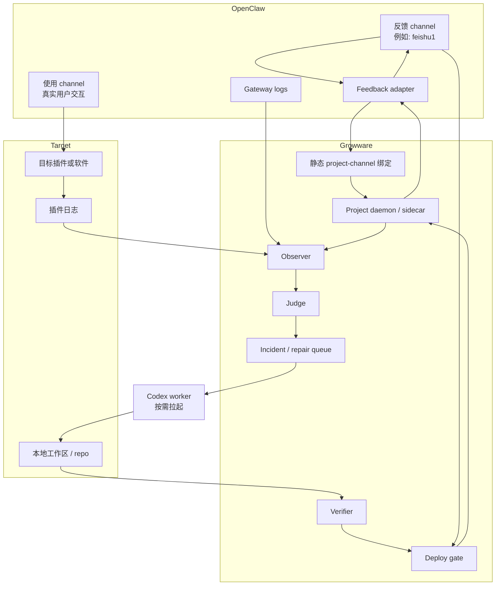
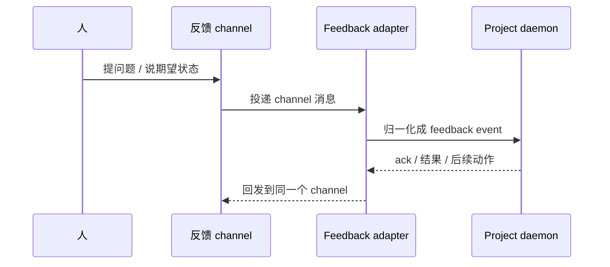

# 架构

[English](architecture.md) | [中文](architecture.zh-CN.md)

## 目的

这份文档描述的是：基于目前讨论，Growware 在第一条 pilot 上最推荐的架构形态是什么。

它会明确站队到当前更现实的方案：

- 先接一个真实的 OpenClaw 项目
- 不做动态 `A/B routing engine`
- 改用显式的静态 channel 绑定
- 每个项目先有一个轻量 `project daemon / sidecar`
- `Codex` 作为按需拉起的修复工人，而不是常驻在每个项目里

阶段顺序和进入门请看 [roadmap.zh-CN.md](roadmap.zh-CN.md) 和 [reference/growware/development-plan.zh-CN.md](reference/growware/development-plan.zh-CN.md)。

## 当前设计结论

当前最推荐的 pilot 形态是：

- `A` 先收缩成 `human feedback ingress`
- `B` 表示真实使用通道以及它产生的运行证据
- `A/B routing` 第一阶段不做成动态智能路由
- 用显式 `project-channel binding` 替代动态路由
- OpenClaw 继续作为宿主 gateway 和生态入口
- Growware 负责补上项目级控制层
- Codex 藏在 Growware 控制层后面，按 incident 被拉起执行

## 职责边界

| 层 | 负责什么 | 不负责什么 |
| --- | --- | --- |
| OpenClaw | channel、session、plugin、hook、service、task/taskflow 基础设施、生态接入 | incident 判定策略、项目级验证规则、修复记忆 |
| Growware | 项目绑定、feedback intake、observer、judge、incident queue、verifier、deploy gate、项目状态 | 替代 OpenClaw 当 gateway、替代 Codex 当 coding agent |
| Codex | incident 分析、改代码、跑验证、产出修复结果 | 常驻 channel、维护 durable 项目状态、决定最终产品策略 |
| 目标项目 / 插件 | 真实运行行为、项目日志、run/test/deploy 钩子 | 跨项目控制策略 |

## 第一条 Pilot 的前提假设

当前架构默认这些前提成立：

- 先只接一个 OpenClaw 里的真实目标项目，例如 `openclaw task system`
- 这个项目有一个明确的人类反馈 channel，例如 `feishu1`
- 这个项目有一个或多个真实使用 channel
- 先本地优先执行和部署
- 部署边界保留人工审批

## 当前推荐拓扑



## 三条主数据流

### 1. 人类反馈流

这就是你刚才已经表达得很清楚的那条线：

`feishu1 -> OpenClaw adapter -> project daemon`

这条线建立之后，项目的人类双向反馈通道就成立了。



### 2. 运行证据流

第一阶段不需要做一个复杂的 `B 路由器`。

它真正需要的是把证据源配清楚，例如：

- OpenClaw gateway logs
- 目标插件日志
- daemon 自己的日志
- 目标项目主动上报的结构化事件

`Observer` 负责采集这些来源，但**采集不等于判定**。

### 3. 修复执行流

当 `Judge` 认为这已经是一个真实 incident 时：

1. Growware 创建或更新 incident 记录
2. 把 incident、repo 上下文和验证命令交给 Codex
3. Codex 在本地工作区里提出或应用修复
4. `Verifier` 跑必要检查
5. `Deploy gate` 决定拒绝、等待审批，还是本地部署
6. 需要时，再把结果回发到反馈 channel

## 为什么第一阶段用静态绑定，而不是动态 Routing

当前 pilot 不需要一个智能 `A/B routing engine`。

它只需要一份显式绑定配置，例如：

```yaml
project_id: project-1
feedback_channels:
  - feishu1
runtime_channels:
  - user-channel-1
watched_plugins:
  - openclaw-task-system
log_sources:
  - openclaw-gateway
  - project-daemon
approval_channels:
  - feishu1
```

在下面这些条件成立时，静态绑定已经够用：

- 项目数量还少
- 每个 channel 的归属是清晰的
- 人一眼能知道这个 channel 属于哪个项目

只有以后出现这些情况，才需要更强的 routing：

- 多个项目共享一个 channel
- 多个项目共享同一批日志来源
- 多个项目要并行修复和并行部署

## 为什么 Judge 不能省

去掉动态 routing，不等于可以去掉 `Judge`。

`Observer` 回答的是：

- 信号从哪里来
- 抓到了哪些证据

`Judge` 回答的是：

- 这是正常噪声，还是 incident
- 严重级别是什么
- 能不能自动修
- 要不要人工审批

如果没有 `Judge`，系统最后还是会退化成：

`看日志 -> 猜是不是问题 -> 拉 Codex 试试`

这不是真正的闭环。

## Project Daemon 的定位

当前推荐的 `project daemon` 故意做薄。

它应该负责：

- 本项目的绑定配置和本地状态
- 监听哪些日志和事件来源
- 接 feedback event 和 incident intake
- 把 repair 任务交给执行器
- 暴露本地 run/test/deploy/rollback 钩子
- 把结果再写回反馈 channel

它不应该变成：

- 一个常驻 Codex 会话
- OpenClaw gateway 的替代品
- 第一天就承担多项目总调度

## 最小事件合同

### Feedback Event

```json
{
  "project_id": "project-1",
  "channel_id": "feishu1",
  "message_id": "msg-123",
  "event_type": "human_feedback",
  "text": "the plugin output is wrong for task creation",
  "related_session_id": "sess-456",
  "related_plugin": "openclaw-task-system",
  "timestamp": "2026-04-13T18:00:00+08:00",
  "requires_reply": true
}
```

### Incident Record

```json
{
  "project_id": "project-1",
  "incident_id": "inc-001",
  "source": "gateway-log",
  "summary": "task creation fails after confirmation",
  "severity": "medium",
  "evidence": ["log excerpt", "session id", "feedback event"],
  "reproducible": false,
  "approval_required": true
}
```

## 部署形态的两个选项

### 方案 1：嵌在 OpenClaw plugin / service 里

形态：

- Growware daemon 直接作为 OpenClaw plugin 或 service 的一部分运行
- 直接复用 OpenClaw 的 hooks、tasks、taskflow 和生态接线能力

适合：

- 第一条 pilot 只服务 OpenClaw 生态
- 希望先把运维面做得最小

### 方案 2：做成外挂 sidecar

形态：

- Growware daemon 运行在 OpenClaw 之外
- OpenClaw 通过 MCP、hook 或其他桥接把事件转给它

适合：

- 你预期 Growware 以后会脱离 OpenClaw 单独演化
- 你希望进程隔离更强

### 当前建议

第一条 pilot 里，这两个方案都可以成立。

真正重要的不是“嵌入还是 sidecar”，而是边界不要混：

- OpenClaw 负责 channel 和生态集成
- Growware 负责项目级控制逻辑
- Codex 负责按需执行修复

## 这份架构明确不做什么

- 不把 Growware 做成 Codex 外面又一层聊天壳
- 不重写 OpenClaw 的 gateway、plugin、task、MCP 能力
- 不假装今天就已经是完整自治平台
- 不在第一阶段就做动态多项目调度器

## 未来扩展点

只有在下面这些需求真的出现时，才应该补更强的项目级 routing 和 orchestration：

- 多个项目共享 channel
- 多个项目共享日志源
- 多个 repair worker 并行执行
- 每个项目要有独立部署门
- 要做跨项目复用的 regression memory
